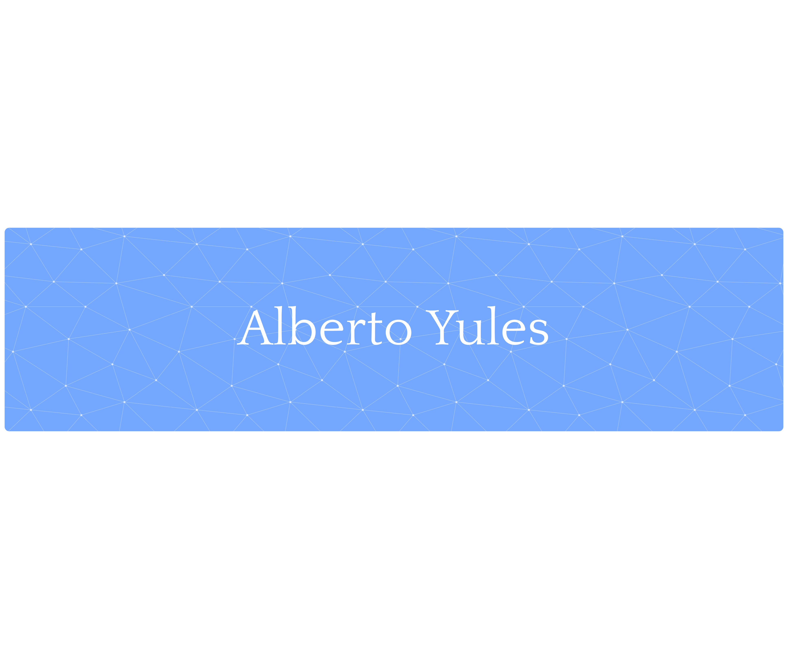

  
  

  

  <h3>Estudiante de Ciberseguridad e Inteligencia Artificial</h3>
  

    Apasionado por la seguridad ofensiva, el análisis de malware y el desarrollo de soluciones basadas en IA. 
    En constante formación y búsqueda de nuevos retos tecnológicos.
  

 

### 💻 Sobre mí

Soy **Alberto Yules**, estudiante especializado en el cruce entre la Ciberseguridad y la Inteligencia Artificial. Mi objetivo es comprender cómo proteger sistemas complejos y cómo utilizar la IA tanto para la defensa como para la mejora de procesos de seguridad.

* **Intereses:** Hacking ético, Machine Learning, Deep Learning, Forense digital y Hardening de sistemas.
* **Enfoque:** Me oriento hacia proyectos técnicos que resuelvan problemas reales de seguridad mediante el uso de datos y automatización.
* **Colaboración:** Abierto a participar en proyectos de código abierto o investigaciones académicas.

---

### 🛠 Stack Tecnológico

Aquí algunas de las herramientas y lenguajes con los que trabajo habitualmente:

  
  
  
  

   

  
  
  
  

   

  
  
  
  

---

### 📬 Contacto

Si quieres contactar conmigo para colaboraciones o consultas profesionales:

* **Email:** [alberyules11@gmail.com](mailto:alberyules11@gmail.com)
* **LinkedIn:** [Alberto Yules Núñez](https://www.linkedin.com/in/alberto-yules-nuñez/)

  

